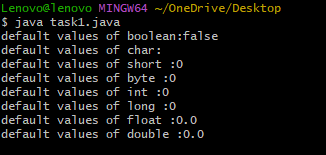
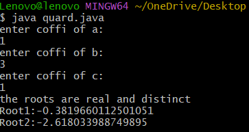
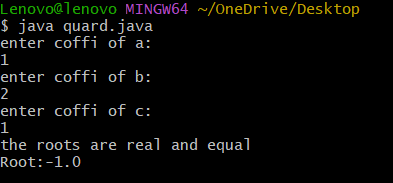
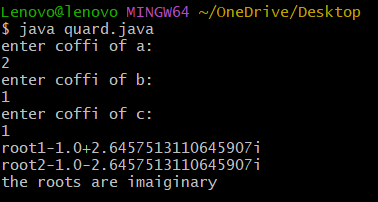

## EXPERIMENT-1
# 1a)Title:Displaying Default primitive datatype
# Source Code:
``` java
public class task1{
boolean bool;
char c;
short s;
byte b;
int i;
long l;
float f;
double d;
public static void main(String args[]){
task1 obj = new task1();
//dispplay default values//
System.out.println("default values of boolean:"+obj.bool);
System.out.println("default values of char:"+obj.c);
System.out.println("default values of short :"+obj.s);
System.out.println("default values of byte :"+obj.s);
System.out.println("default values of int :"+obj.i);
System.out.println("default values of long :"+obj.l);
System.out.println("default values of float :"+obj.f);
System.out.println("default values of double :"+obj.d);
}
}
```
# OUTPUT:

# exp 1b)Title:Calculate the roots of the quadratic equations
# Source Code:
``` java
import java.util.Scanner;
 class quard{
 public static void main(String[] args){
 Scanner s=new Scanner(System.in);
System.out.println("enter coffi of a:");
double a=s.nextDouble();
System.out.println("enter coffi of b:");
double b=s.nextDouble();
System.out.println("enter coffi of c:");
double c=s.nextDouble();
s.close();
double D=b*b-4*a*c;
if(D>0){
double root1=(-b+Math.sqrt(D))/2*a;
double root2=(-b-Math.sqrt(D))/2*a;
System.out.println("the roots are real and distinct");
System.out.println("Root1:"+root1);
System.out.println("Root2:"+root2);
}
else if(D==0){
double root=-b/2*a;
System.out.println("the roots are real and equal");
System.out.println("Root:"+root);
}
else{
double realpart=-b/2*a;
double imaginary=Math.sqrt(-D)/2*a;
System.out.println("root1"+realpart +"+" +imaginary +"i");
System.out.println("root2"+realpart +"-" +imaginary +"i");
System.out.println("the roots are imaiginary");
}
}
}
```
# output:
# case1:(D>0):

# case2:(D=0):

# case3:(D<0):

