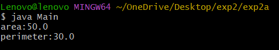
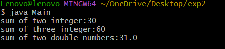
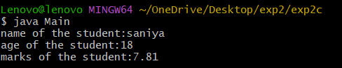

# Experiment-2a
# Title: To implementation of class mechanism in java
# Source code:
``` java
public class rectangle {
double length;
double breadth;
double area() {
return length * breadth;
}
double perimeter() {
return 2 * (length + breadth);
}
}
```
``` java
public class Main {
public static void main(String[] args)
{
rectangle r = new rectangle();
r.length = 10;
r.breadth = 5;
System.out.println("area:"+r.area());
System.out.println("perimeter:"+r.perimeter());
}
}
```
# Output:

# Experiment-2b
# Title: To implimentation method of overloading
# Source code:
``` java
class sum {
int sum(int a, int b) {
return a + b;
}
int sum(int a, int b, int c) {
return a + b + c;
}
double sum(double a, double b) {
return a + b;
}
}
```
``` java
class Main {
public static void main(String[] args)
{
sum s = new sum();
System.out.println("sum of two integer:"+s.sum(10, 20));
System.out.println("sum of three integer:"+s.sum(10, 20, 30));
System.out.println("sum of two double numbers:"+s.sum(10.5, 20.5));
}
}
```
# Output:

# Experiment-2c
# Title: To implimentation of constructor
# Source code
``` java
class student {
String name;
int age;
double marks;
student(String n, int a, double m) {
name = n;
age = a;
marks = m;
}
void display() {
System.out.println("name of the student:"+name);
System.out.println("age of the student:"+age);
System.out.println("marks of the student:"+marks);
}
}
```
``` java
class Main {
public static void main(String[] args)
{
student s = new student("saniya",18,7.81);
s.display();
}
}
```
# Ouput:

