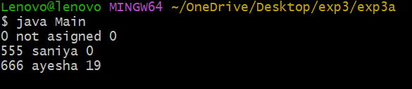

# exp3a
# title:To implement constructor overloading in java
# source code:
``` java
class student {
int id;
String name;
int age;
//default constructor
student() {
id = 0;
name = "not asigned";
age = 0;
}
//constructor with two parameters
student(int i, String n) {
id = i;
name = n;
age = 0;
}
//constructor with three parameters
student(int i, String n, int a) {
id = i;
name = n;
age = a;
}
void display() {
System.out.println(id + " " + name + " " + age);
}
}
```
``` java
class Main {
public static void main(String[] args)
{
student s1 = new student();
student s2 = new student(555, "saniya");
student s3 = new student(666, "ayesha", 19);
s1.display();
s2.display();
s3.display();
}
}
```
# output:

